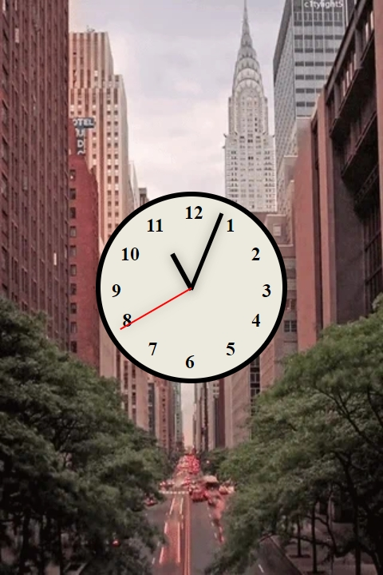

# Real-Time Clock

A visually interactive clock that displays the current time using rotating hands. This project showcases a dynamic clock with a responsive design and smooth transitions for the hour, minute, and second hands.

## Description

This project provides a real-time clock with rotating hands that update every second. It uses HTML, CSS, and JavaScript to create an elegant and functional design. The clock features smooth transitions for the second, minute, and hour hands, as well as a visually appealing background image. The hands rotate smoothly to reflect the current time, with the second hand receiving special attention to avoid any "jumping" behavior. The app is fully responsive, adapting to various screen sizes.

## Features

- Real-time clock with smoothly rotating hands for hours, minutes, and seconds.
- Responsive design that adjusts to different screen sizes (mobile, tablet, and desktop).
- Elegant background image that enhances the clock's appearance.
- Animated transitions for the hands, with special attention to the second hand to prevent sudden jumps.
- Clean and modern design with a visually centered clock face.

## Technologies Used

- HTML
- CSS
- JavaScript

## How to Run

1. Clone the repository to your local machine.
2. Open `index.html` in your web browser.
3. Alternatively, you can view the live project on GitHub Pages: [Real-Time Clock on GitHub Pages](https://deannamandarino.github.io/js-clock/).

## Acknowledgments

This project was completed as part of the JavaScript30 course. Special thanks to Wes Bos for the excellent resources and guidance throughout the course.